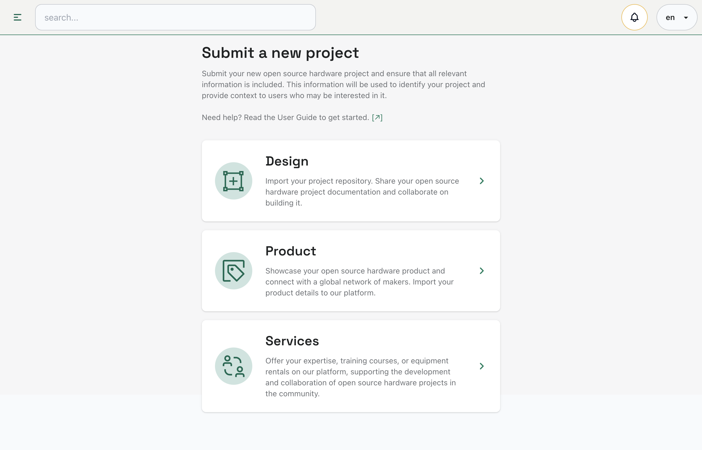
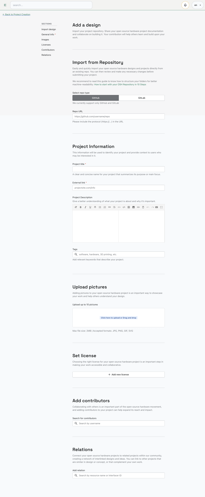
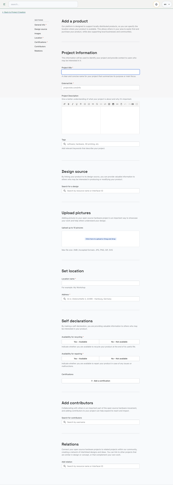
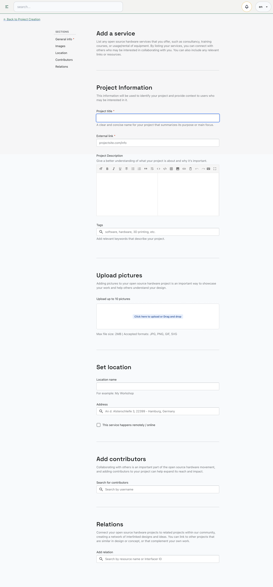

# Add project
Welcome to the creation form for your new open source hardware project. This form will guide you through the necessary steps to create a new project and ensure that all relevant information is included to enable collaboration with others.

With fields for project title, description, tags, images, and documentation, you can provide all the necessary information for others to understand and contribute to your project. Plus, with features like version control, licensing options, and project updates, you can ensure that your project is always up-to-date and accessible to your community of makers, designers, and engineers.

**Simply select whether your project is a _design_, _service_, or _product_, and fill out the relevant fields with your project details.**

## Design
Design: **Import your project repository**. Share your open source hardware project documentation, connecting with others in the community and contributing to the advancement of open source hardware.

## Product 
Product: Submit your completed physical product to our platform, making it available for pickup or delivery and contributing to the growth of the open source hardware movement.

## Service
Service: Offer your expertise, training courses, or equipment rentals on our platform, supporting the development and collaboration of open source hardware projects in the community.

------

# Relations: connect several projects into a new one 
When creating or exploring Open Source Hardware (OSH) projects, it's important to understand the relationships between them. 

Projects can be related in many ways, such as through design inspiration, collaboration, or shared components. You can use the "**_Relation_**" feature to link your project to others that share similar goals or components, making it easier for others to find and contribute to your project. Additionally, by exploring related projects, you can find new ideas and potential collaborators for your own OSH projects.

## Relations and DPP
The **_Digital Product Passport (DPP)_** is a tool that allows users to keep track of important information about their open hardware project, such as its design, components, and production processes. With the DPP, users can easily share information about their project with others and ensure that everyone has access to accurate and up-to-date information. 

Additionally, the DPP can be used to track the relationships between different open hardware projects, allowing users to easily identify dependencies and potential areas for collaboration.