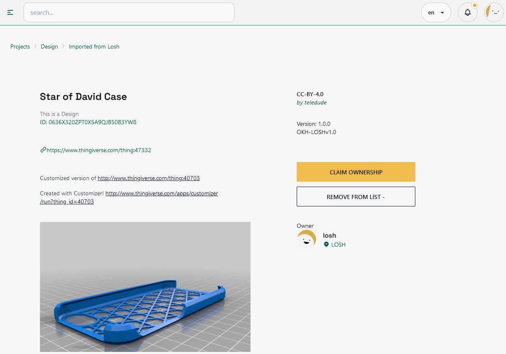

# Import from LOSH

We are importing the LOSH results in order to enable makers and designer to build and collaborate on-top of already existing components and projects.

The platform takes further the effort of making the designer’s work more visible and readable, both by people and by machines, enabling future automation and machine learning features as well as project peer review and improvement proposals, users feedback and remixing opportunities.

LOSH crawls data from several platforms and connects it in a graph database. Read more about [LOSH!](https://losh.opennext.eu/)