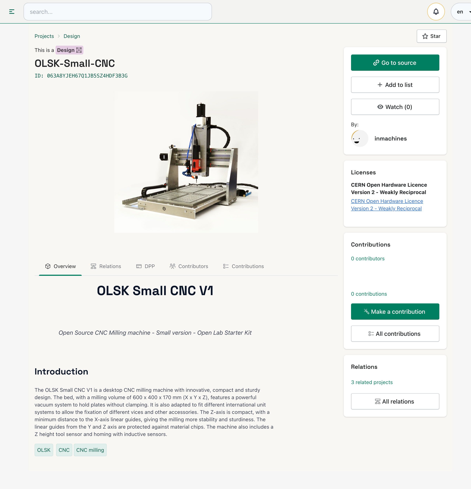

# Project Page

## Oper Know How (OKH) Checker

### Adopting Open Source Hardware Standards for Better Quality and Compatibility

At Interfacer, we're committed to promoting the growth and success of open source hardware projects. That's why we've adopted the command line tool of OSH technical project linting and quality assessment based on the Open Know How (OKH) standard. By utilizing this standard, we're able to make OSH projects more compatible and comparable via metadata. This, in turn, facilitates searching and filtering of already existing projects and components, making it easier for makers, designers, and engineers to find what they need.

### How it works

Our platform fully supports the OKH standard by displaying the compliance report and by directing users to the most up-to-date guideline for further support. By adopting these standards, we're able to ensure better quality and compatibility across all of our open source hardware projects, making it easier than ever to collaborate and innovate. 