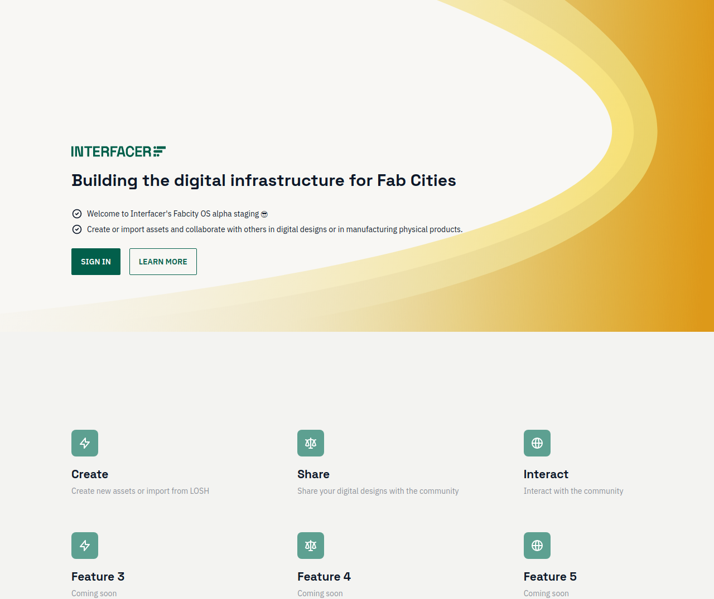
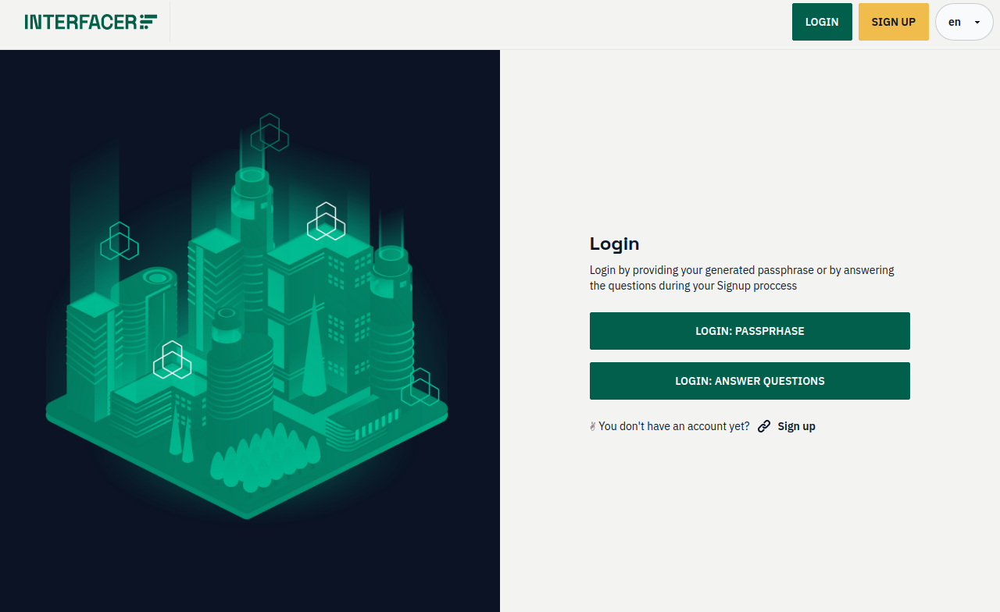
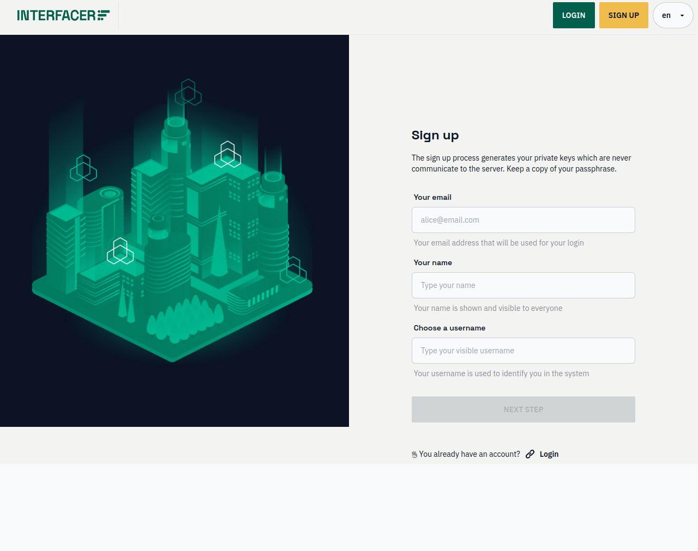
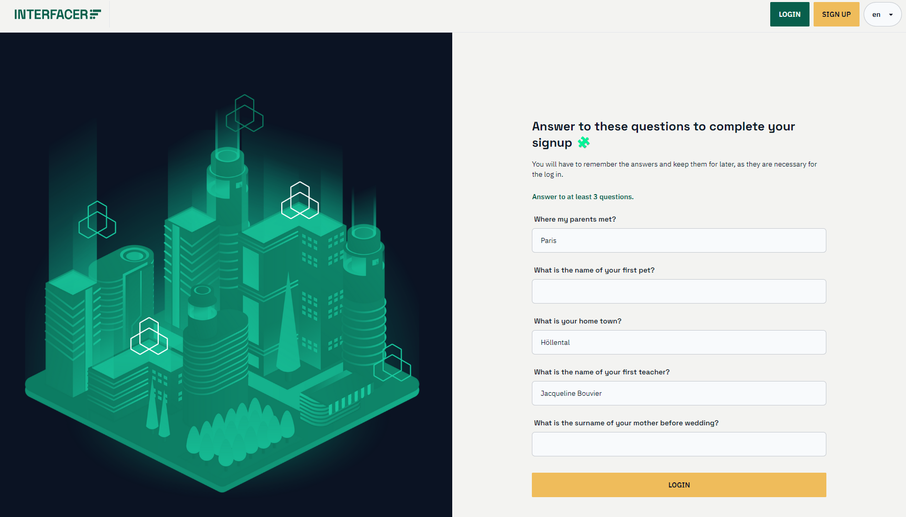
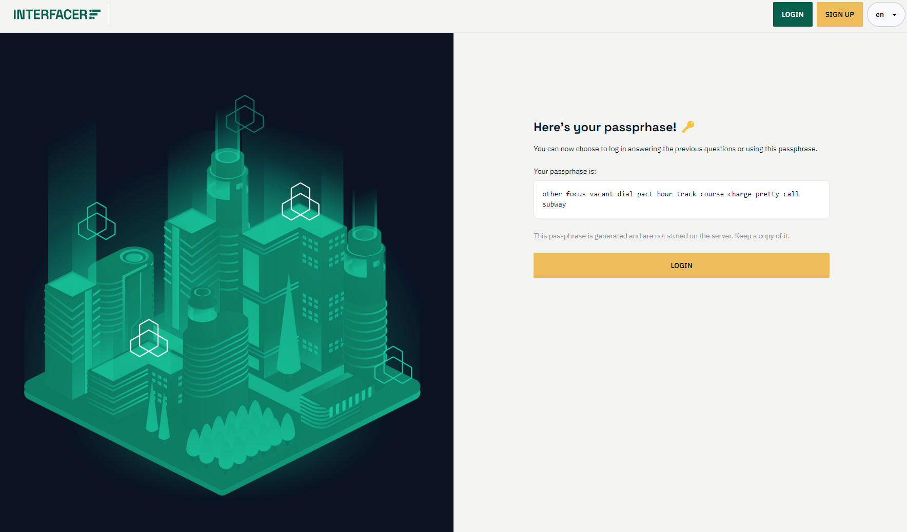
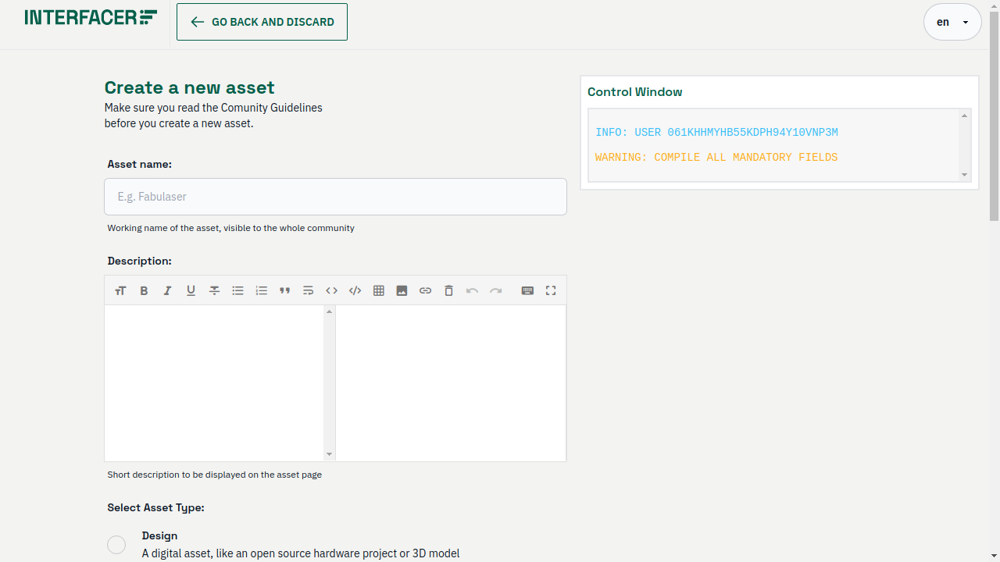
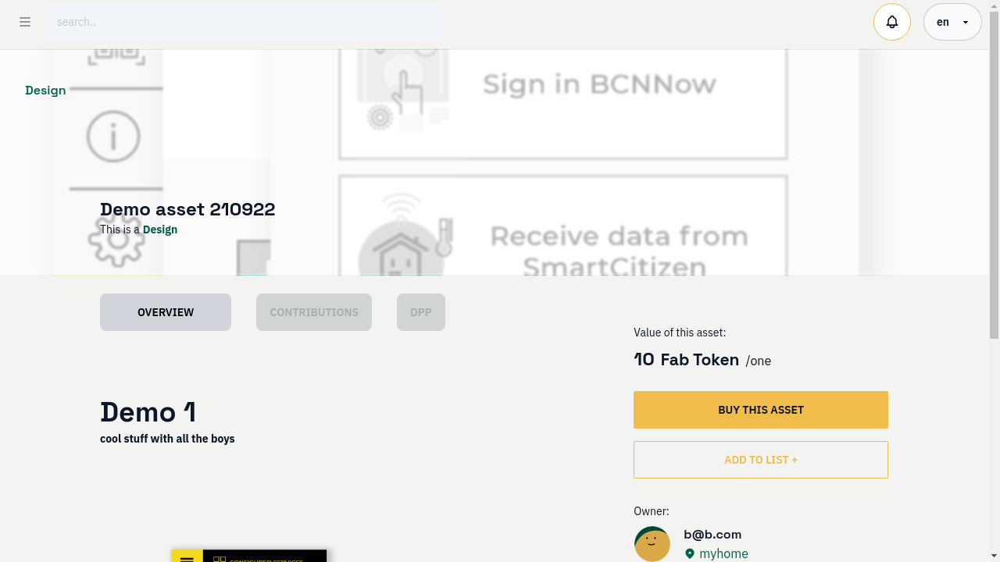
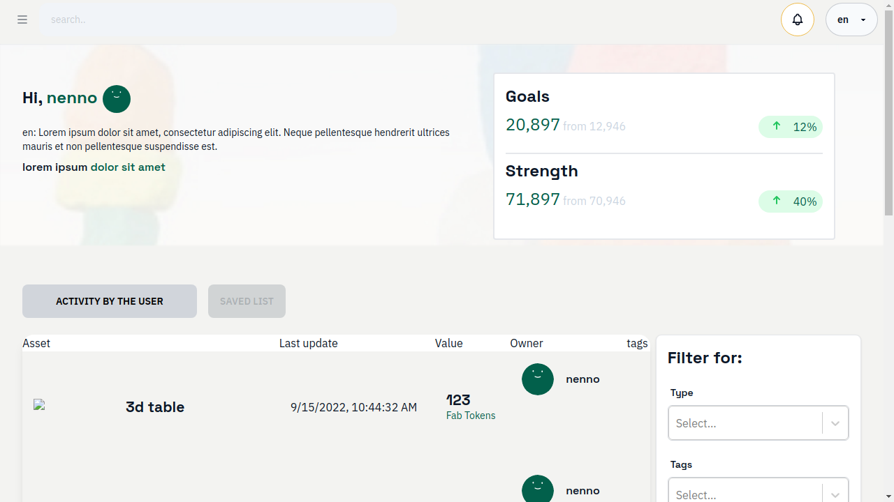
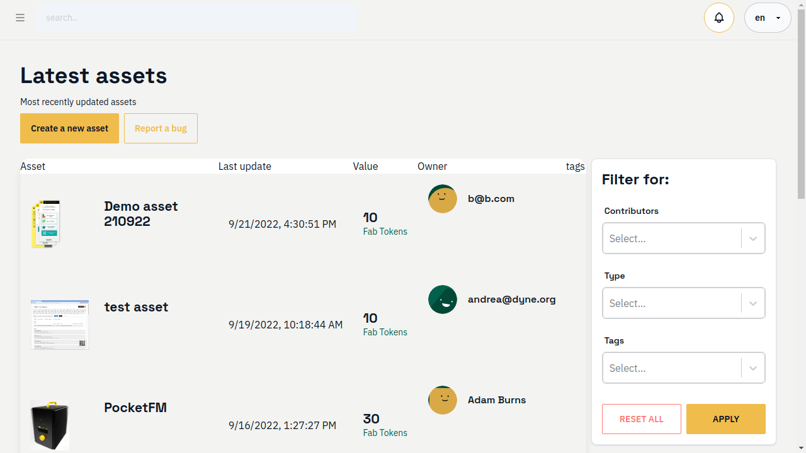
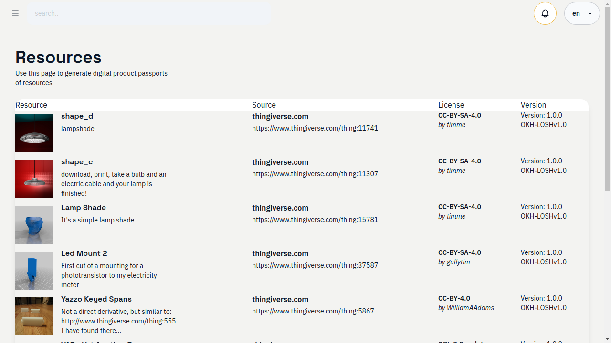

<!--
SPDX-License-Identifier: AGPL-3.0-or-later
Copyright (C) 2022-2023 Dyne.org foundation <foundation@dyne.org>.

This program is free software: you can redistribute it and/or modify
it under the terms of the GNU Affero General Public License as
published by the Free Software Foundation, either version 3 of the
License, or (at your option) any later version.

This program is distributed in the hope that it will be useful,
but WITHOUT ANY WARRANTY; without even the implied warranty of
MERCHANTABILITY or FITNESS FOR A PARTICULAR PURPOSE.  See the
GNU Affero General Public License for more details.

You should have received a copy of the GNU Affero General Public License
along with this program.  If not, see <https://www.gnu.org/licenses/>.
-->

<!--- Future manual, page by page	

 
 --->

# Intro

Welcome to Interfacer. 
On the landing page you can click on **sign in** to sign-in (if you haven't yet created a user) or sign-up.

 

# Design, Product, Service

# Sign-in

The sign-in page offers you three options: 
 - Sign up
 - Sign in: passphrase 
 - Sign in: answer questions

## Sign-up 

When signing up, you have to type in a valid email, your name and a username

### Sign-up questions

Next, you need to answer as many (at least 3) of these 5 questions: it's important that you choose the questions and the answers carefully, as those can later be used to sign in the platform.

### Sign-up passphrase

After typing your answers, the platform will return you a **mnemonic passphrase** that you should store somewhere safe as you can later use it for sign-in the platform (from the a different browser or device, or if your browser storage is deleted).

## Sign-in for existing users

After you have created a user, you can sign in from a different device (or browser) 

- **Sign-in: passphrase** by entering your email and using your stored passphrase 

- **Sign-in: answer questions** if you don't have your passphrase, you can entering your email and answer to the questions in the same way you did when you first signed-up.

## Under the hood: sign-up process explained

The sign up process producess a set of crytpographic private and public keys, as well as a passphrase:
- The ***private keys*** are **stored in the browser storage** (and never communicated with the server)
- The ***public key*** is **communicated to the server**
- The ***passphrase*** is something you should to **store somewhere safe**

If the private key is not there (cause you are logging in from a different device/browser or you have deleted the history of your browser), **the passphrase can be used as a substitute to the private key** to sign-in the platform.

Behind the sign-up process is the cryptographic flow [Keypairoom](https://github.com/dyne/keypairoom/).

# Top bar: Menu button, Search bar, Notifications, Language preferences

- Menu button: on your left you will always fing the menu button that, when tapped, it opens the left side menu
- Search bar: you can use the search bar for finding other projects and other people based on their name and keywords contained in their description text.
- Notifications: internal notification system, used for sending and receiving collaboration requests and updates about the projects you decide to follow
- Language preferences: At any time, you can easily change your language preferences. Nevertheless, the translations are automatic, not perfect and a continues community effort where support is needed

# Projects

New Projects can be manually created, imported, or claimed. Existing Projects can be searched. 

## Create project

You can currently create a project manually (or claim it from the ones imported from LOSH, see below). It's important to fill all the required fields:

## Project page 

The asset page contains all the information about the asset, including: 
 - Name
 - Location
 - Screenshot
 - (more to come)

## My projects

Your list of projects can be found in the **Projects > My projects** submenu. Your projects can be filtered and searched. You can open a project by clicking onto its name.

## Projects

In **Projects > Latest Projects** you can find the list of all the projects in the platform, sorted chronologically. The projects can be searched and filtered.

## Imported from LOSH

In **Projects > Imported from LOSH** you can find all the projects imported from [https://losh.opennext.eu/](https://losh.opennext.eu/). You can claim your assets and added to your asset list.

# Report a bug

You can report a bug by creating an **issue** on the [interfacer-gui](https://github.com/dyne/interfacer-gui/issues/new) repo.

