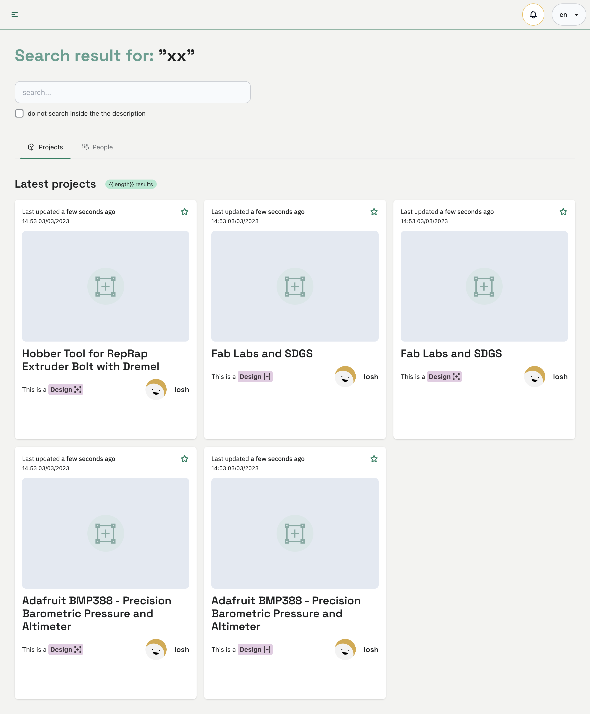

# Search project
The search bar is a powerful tool that allows you to quickly find open hardware designs, products, and services that match your interests. 

## Search
You can use tags to narrow down your search to specific topics, or search by users to find projects from people you trust. You can also search by location to find projects near you or browse by categories to find projects that fit your needs. With the search bar, finding the right open hardware project has never been easier.

## Map 

